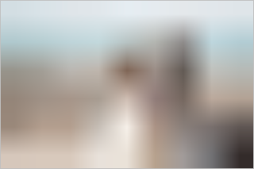
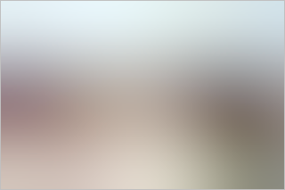

# ember-responsive-image

[](https://github.com/kaliber5/ember-responsive-image/actions?query=workflow%3ACI)
[](https://badge.fury.io/js/ember-responsive-image)
[](https://emberobserver.com/addons/ember-responsive-image)

An ember-cli addon to automatically generate resized images at build-time, optimized for the responsive web, and using components to render
  them easily as `<picture>` elements. 

## Key Features

🌇  Supports basic PNG and JPEG formats, as well as next-gen [**WebP**](https://developer.mozilla.org/en-US/Web/Media/Formats/Image_types#webp) and [**AVIF**](https://developer.mozilla.org/en-US/Web/Media/Formats/Image_types#avif), for best image quality at low file sizes.

🏎  Super **fast image processing**, thanks to the awesome [sharp](https://github.com/lovell/sharp) library.

📱  Layout modes for **fixed sizes** (with `1x` and `2x` image variants) as well as **responsive layouts** (`srcset` with optimized image sizes across all devices). 

🌍  Besides processing of local images, it also supports integrating remote images from **image CDNs** like [Cloudinary](https://cloudinary.com/) or [imgix](https://imgix.com/) using a versatile image provider abstraction

💯  **Lazy rendering** by default, with optimized `content-visibility` and `decoding` settings and optimized markup, to prevent [**CLS**](https://web.dev/cls/) (*Cumulative Layout Shift*), a core [Web Vital](https://web.dev/vitals/) and [Lighthouse](https://developers.google.com/web/tools/lighthouse) metric.

⏳  Supports advanced **LQIP** (*Low Quality Image Placeholder*) techniques to show a preview while loading, using different configurable strategies
like a blurry low-res image, [BlurHash](https://blurha.sh/) or a simple dominant color. 

✨  Octane-based, written mostly in **TypeScript**, using **Glimmer** components, supporting [FastBoot](https://ember-fastboot.com/) and [Embroider](https://github.com/embroider-build/embroider), and fully tested.

️⚙  Flexible configuration options

Advanced optimization techniques inspired amongst others by the blog post [Maximally optimizing image loading for the web in 2021](https://www.industrialempathy.com/posts/image-optimizations/).

Compatibility
------------------------------------------------------------------------------

* Ember.js v3.20 or above
* Ember CLI v3.20 or above
* Node.js v12 or above


## Getting started

### Migration

If you were previously using an older version (<2.x) of this addon, there is a [Migration Guide](docs/MIGRATION.md) to help you go through the (many!) breaking changes.

### Install in ember-cli application

In your application's directory:

```bash
ember install ember-responsive-image
```

### Add a basic configuration

Add a basic configuration to your `ember-cli-build.js`, to point the addon to where your images are that:

```js
module.exports = function (defaults) {
  let app = new EmberAddon(defaults, {
    'responsive-image': {
      images: [
        {
          include: 'assets/images/**/*',
          widths: [2048, 1536, 1080, 750, 640],
        }
      ],
    }
  });
};
```

Find more details about all available [configuration options](#configuration) below.

## Basic Usage

### The `<ResponsiveImage/>` component

In a template you can use the `<ResponsiveImage/>` component. The image argument is required and must be a path to one of the configured image files:

```hbs
<ResponsiveImage @src="assets/images/dog.jpg"/>
```

This will generate an `` element wrapped in `<picture>` referencing all the resized images in the different formats, for the browser to decide which image it can support and fits best given the current context (device, screen size, user preferences like low bandwidth etc.):

```html
<picture>
  <source srcset="/assets/images/dog1920w.avif 1920w, /assets/images/dog1280w.avif 1280w, /assets/images/dog640w.avif 640w, /assets/images/dog320w.avif 320w" type="image/avif">
  <source srcset="/assets/images/dog1920w.webp 1920w, /assets/images/dog1280w.webp 1280w, /assets/images/dog640w.webp 640w, /assets/images/dog320w.webp 320w" type="image/webp">
  <source srcset="/assets/images/dog1920w.jpg 1920w, /assets/images/dog1280w.jpg 1280w, /assets/images/dog640w.jpg 640w, /assets/images/dog320w.jpg 320w" type="image/jpeg">
  
</picture>
```

The image in the `src` attribute is calculated by the component and will be used by browsers [without `<picture>` support](https://caniuse.com/picture) - which is basically IE11.

If your image width is not `100vw`, say `70vw` for example, you can specify the `@size` (only `vw` is supported as a unit for now):

```hbs
<ResponsiveImage @src="assets/images/dog.jpg" @size="70"/>
```

This will render the corresponding [`sizes` attribute](https://developer.mozilla.org/en-US/docs/Web/HTML/Element/source#attr-sizes) on all `<source>` elements.
You can also set the attribute like this if your responsive image width is more complicated:

```hbs
<ResponsiveImage @src="assets/images/dog.jpg" @sizes="(min-width: 800px) 800px, 100vw"/>
```

### Fixed layout

The example above assumed you wanted a responsive image, i.e. one that automatically takes the whole available width of its parent element.
This is the default mode, and will automatically the following CSS to you image:

```css
img {
  width: 100%;
  height: auto;
}
```

But this addon also supports a *fixed* layout with fixed image dimensions. Just provide either `@width` or `@height` to opt into that mode:

```hbs
<ResponsiveImage @src="assets/images/dog.jpg" @width={{320}}/>
```

It will still render a `` wrapped in a `<picture>`, but this time it will provide the image with the optimal width (smallest width which is equal or above the target width),
and additionally a `2x` variant for devices with high pixel densities:

```html
<picture>
  <source srcset="/assets/images/dog320w.avif 1x, /assets/images/dog640w.avif 2x" type="image/avif">
  <source srcset="/assets/images/dog320w.webp 1x, /assets/images/dog640w.webp 2x" type="image/webp">
  <source srcset="/assets/images/dog320w.jpg 1x, /assets/images/dog640w.jpg 2x" type="image/jpeg">
  
</picture>
```

> Note it is sufficient to supply either `@width` or `@height`, the component will still render the missing attribute according to the
image's aspect ratio!

## Image formats

Besides the basic PNG and JPEG also the next-gen formats [WebP](https://developer.mozilla.org/en-US/Web/Media/Formats/Image_types#webp) and [AVIF](https://developer.mozilla.org/en-US/Web/Media/Formats/Image_types#avif) are supported.
While every modern browser [supports WebP](https://caniuse.com/webp) meanwhile, AVIF is a relatively new format and not well [supported](https://caniuse.com/avif) yet. But given the
way multiple formats are supported using this addon as described above, browsers that support one of those will load them, while other will fallback to basic PNG/JPEG.

To give you an idea of the improvements possible with these formats, here are some examples. *Note that the images might
not show correctly if you are not using Chrome.* 

A more detailed analysis can be found on [Jake Archibald's blog](https://jakearchibald.com/2020/avif-has-landed/).

### JPEG

Dimensions: 640px &times; 427px
File size: **16KB**.


### WebP

Dimensions: 640px &times; 427px
File size: **10KB**.


### AVIF

Dimensions: 640px &times; 427px
File size: **7KB**.


> Note: Generating AVIF files can take a lot of time, as it is very CPU-intensive. Therefore and given the limited browser support,
the format is currently not enabled by default. You would have to opt-in, by defining the `formats` [configuration option](#configuration) to included AVIF.

## LQIP

*Low Quality Image Placeholder* is a technique to give users a preview of the image while it is loading. This addon supports different types,
all with their own tradeoffs. Based on the cute dog you saw above, you can see here how these different techniques will look like.

See the [Configuration](#configuration) section for how to configure these.

### Color

This is the most basic technique, calculating the dominant color of the image, and setting it as the background color of the images while it loads.
The "cost" is basically 7bytes, for the hex code of the color.


### Inline

This creates a very small thumbnail of the original image, wraps it into a SVG and applies a blurry filter. This is then
set as a base64 encoded data-URL as the background of the image while it loads. The example below consumes 348 bytes (uncompressed).



### Blurhash

[BlurHash](https://blurha.sh/) is an encoding algorithm and library, dedicated for the very purpose of generating nice looking blurry placeholders, without the 
overhead of a real image format, which was never optimized for that kind of *tiny* images. This example consumes just 40 bytes (uncompressed). 



But the tradeoff here is that it needs a runtime library for decoding, which takes about 4.7KB (1.9KB compressed). Therefore it
is less suited if you have just a few images, but shines if you need placeholders for a lot!

## Image Providers

So far we have only dealt with local images - static images that are commonly part of your app's git repo and get processed by this addon during the build process.
But this is addon provides even a more versatile abstraction to use any kind of (remote) images: image providers. 

A provider is basically an Ember helper that returns a [`ProviderResult`](addon/types.ts), which contains some meta data for a given image, and
a function to compute the actual URL for each referenced image, based on its width and type. You can use one of the providers 
that ship with this addon, or even write your own one. As long as it returns the appropriate data, the `<ResponsiveImage/>` component
will be able to render all the image markup as described above.

Simply pass the result of the helper as the `@src` of the component:

```hbs
<ResponsiveImage @src={{some-image-provider "some/image.jpg"}}/>
```

In fact you have already used one such provider, the `responsive-image-local-provider`, which is the default one. 
Invoking the component with the reference to an image as a string...

```hbs
<ResponsiveImage @src="assets/images/dog.jpg"/>
```

is basically syntactic sugar for...

```hbs
<ResponsiveImage @src={{responsive-image-local-provider "assets/images/dog.jpg"}}/>
```

Besides local images, providers allow using also remote images. The most common use case is to load images from an [image CDN](https://web.dev/image-cdns/), that
is then used to offload all image processing. Moreover, this allows for *dynamic* image processing, in cases where your images are not 
available at build-time. For example you could have an `ember-data` model refer to the raw (large, unprocessed) image, and use
an image CDN as a proxy to scale, optimize and deliver that image as needed, at *runtime*.

The addon currently ships with these image providers (besides the local one) out of the box:
* [Cloudinary](docs/providers/cloudinary.md)
* [imgix](docs/providers/imgix.md)


## Configuration

Configuration of the addon is done in your `ember-cli-build.js`:

```js
let app = new EmberAddon(defaults, {
  'responsive-image': {
    fingerprint: true,
    deviceWidths: [640, 750, 828, 1080, 1200, 1920, 2048, 3840],
    providers: {},
    images: [
      {
        include: ['path/to/images/**/*'],
        exclude: ['path/to/images/but-not-this/**/*'],
        widths: [2048, 1536, 1080, 750, 640],
        formats: ['avif', 'webp'],
        quality: 50,
        lqip: {
          type: 'inline',
          targetPixels: 60,
        },
        removeSource: true,
        justCopy: false,
      },
      // possible more items
    ],
  }
});
```

### Options

* **fingerprint**: Can be used to enable/disable fingerprinting of the generated image files. In most cases you can omit
setting this explicitly, as it will follow whatever you have set under the main `fingerprint` options (used by the `broccoli-asset-rev` addon), 
with the default being to enable fingerprinting only in production builds.
* **deviceWidths**: an array of widths representing the typical screen widths of your user's devices, used when the available image widths are not known beforehand, like when using an image CDN.
* **providers**: configuration for specific providers goes here, see the appropriate [provider docs](docs/providers) for more details.
* **images**: The main configuration how the addon generated images happens here, see the following section for details.

### Image Options

When using images stored locally, the main configuration happens with the `images` array. There you must define at least one configuration item, with at least `include` defined. 
But you can provide more, to create separate configurations for different images. 

For example if you have a gallery of logos, of which all will be displayed with a width of max. 300px or less,it makes no sense to create very 
large images for these, so a setting of `widths: [300, 600],` would make sense here (600px for the `2x` version aka "retina").

> Make sure you don't have multiple `include` definitions accidentally overlapping! You can use `exclude` in this case to prevent this.

* **include:** Glob pattern for which images should be processed based on this configuration.
* **exclude:** Optional pattern which images to exclude, takes precedence over `include`.
* **widths:** These are the widths of the resized images.
* **formats:** which image formats to produce. Supported are: `avif`, `webp`, `png` and `jpeg`. `original` is a special keyword here, representing the image format of the original source image. By default: `['original', 'webp']`
* **quality:** Image quality (JPEG, WebP, AVIF)
* **lqip:** Let's you opt into generating LQIPs, by setting at the `type`to one of the supported values. Disabled by default! 
* **lqip.type:** `'inline'`, `'color'` or `'blurhash'`. See the [LQIP section](#lqip) for more details.
* **lqip.targetPixels:** Desired approximate amount of pixels to use for the placeholder (does not apply for `color`).
* **removeSource:** If true, the (large) source images will be removed from the build.
* **justCopy:** If true, the images will just be copied without resizing. This can be useful for development builds to speed things up, but should be false for production.

**Note:** If the width of your origin image is less than the generated should be, the image will be generated unresized.


## Advanced Usage

The addon provides a service and a helper for more advances usages if required. You can also build addons that hook
into the image precessing pipeline. This is described in detail in the [Advanced Usage documentation](docs/ADVANCED.md).

Contributing
------------------------------------------------------------------------------

See the [Contributing](CONTRIBUTING.md) guide for details.


License
------------------------------------------------------------------------------

This project is licensed under the [MIT License](LICENSE.md).
