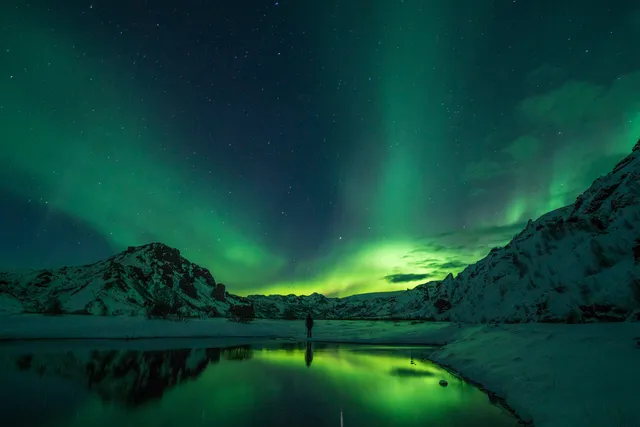

# Image formats

Besides the basic PNG and JPEG also the next-gen formats [WebP](https://developer.mozilla.org/en-US/Web/Media/Formats/Image_types#webp) and [AVIF](https://developer.mozilla.org/en-US/Web/Media/Formats/Image_types#avif) are supported.
Every modern browser [supports WebP](https://caniuse.com/webp). AVIF is also pretty well [supported](https://caniuse.com/avif), but takes longer to generate. Given the
way multiple formats are supported using this addon as described above, browsers that support one of those will load them, while other will fallback to basic PNG/JPEG.

To give you an idea of the improvements possible with these formats, here are some examples. _Note that the images might
not show correctly if you are not using a modern browser._

A more detailed analysis can be found on [Jake Archibald's blog](https://jakearchibald.com/2020/avif-has-landed/).

### JPEG

Dimensions: 640px &times; 427px
File size: **30KB**.

### WebP

Dimensions: 640px &times; 427px
File size: **18KB**.

### AVIF

Dimensions: 640px &times; 427px
File size: **8KB**.

> [!WARNING]
> Generating AVIF files can take a lot of time, as it is very CPU-intensive. Therefore
> the format is currently not enabled by default in [build plugins](../build) for local images.
